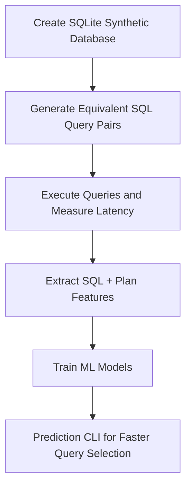

# 📌 **QueryOptimizerAI — Machine Learning Model for SQL Query Performance Prediction**

**QueryOptimizerAI** is a machine learning system that predicts **which version of two semantically equivalent SQL queries will execute faster**. It automatically:

- Generates SQL query pairs (e.g., `IN` vs `EXISTS`, `JOIN` vs subquery)
- Executes them on a synthetic SQLite database  
- Collects latencies + EXPLAIN QUERY PLAN  
- Extracts structural & plan-based features  
- Trains ML models to predict latency and choose the faster variant  
- Provides a CLI tool to compare two SQL queries  

This project blends **Databases**, **Systems**, and **Machine Learning** — ideal for research and performance optimization.

---

# 🚀 **Why This Project?**

SQL performance highly depends on *how* the query is written:

| Query Variant | Performance Effect |
|--------------|-------------------|
| `IN` vs `EXISTS` | Big difference on large datasets |
| `JOIN` vs subquery | Optimizer may not fully rewrite |
| Indexed vs non-indexed ORDER BY | Huge latency gap |
| Aggregation functions (`COUNT(*)` vs `COUNT(col)`) | Varies by engine |

Even small query differences can have large performance impacts.

**QueryOptimizerAI learns these patterns automatically.**

---

# 🧠 **Architecture Overview**



---

# 🗂️ **Project Structure**

```
query-optimizer-ai/
├── data/
│   ├── synth.db
│   ├── timings.csv
│   ├── features_individual.csv
│   └── features_pairs.csv
├── src/
│   ├── create_db.py
│   ├── generate_queries.py
│   ├── run_queries.py
│   ├── extract_features.py
│   ├── train_model.py
│   └── predict_cli.py
├── notebooks/
│   └── 01_eda_and_model.ipynb
├── models/
│   ├── regressor.joblib
│   └── pairwise_clf.joblib
└── README.md
```

---

# 🛠️ **Installation & Setup**

### ✅ **1. Clone the project**

```bash
git clone https://github.com/your-username/query-optimizer-ai
cd query-optimizer-ai
```

### ✅ **2. Create and activate virtual environment**

```bash
python3 -m venv .venv
source .venv/bin/activate
```

### ✅ **3. Install dependencies**

```bash
pip install -r requirements.txt
pip install joblib
```

---

# ✅ **Full Pipeline — How to Run the Project**

### **1. Create synthetic SQLite database**
```bash
python src/create_db.py
```

### **2. Generate SQL query pairs**
```bash
python src/generate_queries.py
```

### **3. Execute queries and measure latency**
```bash
python src/run_queries.py
```

### **4. Extract structural + plan-based features**
```bash
python src/extract_features.py
```

### **5. Train ML models (Regression + Classification)**
```bash
python src/train_model.py
```

Models will be stored in `models/`.

---

# 💡 **Using the Query Comparator CLI**

Compare any two SQL queries:

```bash
python src/predict_cli.py \
"SELECT ... query A ..." \
"SELECT ... query B ..."
```

The CLI prints:

✅ Query A execution plan  
✅ Query B execution plan  
✅ Predicted latency (log-scale)  
✅ **Final verdict: A is faster / B is faster**

Example (IN vs EXISTS):

```bash
python src/predict_cli.py \
"SELECT u.user_id FROM users u WHERE u.country='IN' AND u.user_id IN (SELECT o.user_id FROM orders o WHERE o.status='delivered');" \
"SELECT u.user_id FROM users u WHERE u.country='IN' AND EXISTS (SELECT 1 FROM orders o WHERE o.user_id=u.user_id AND o.status='delivered');"
```

---

# 📊 **Results & Visualizations**

### ✅ **1. Latency Distribution**
```

```

### ✅ **2. Correlation Heatmap**
```

```

### ✅ **3. Top 15 Regression Feature Importances**
```

```

### ✅ **4. Top 15 Classification Feature Importances**
```

```

---

# ✅ **Model Performance (From Notebook)**

| Task | Metric | Value |
|------|--------|--------|
| Regression (Latency Prediction) | MAE | **X ms** |
| Regression | R² | **Y** |
| Classification (A faster?) | Accuracy | **Z%** |
| Classification | F1 Score | **W** |

(Replace X/Y/Z/W with your actual notebook results.)

---

# 🔬 **Key Technical Insights**

- Queries using **INDEX SCAN** tend to be significantly faster.  
- `JOIN` is often faster than equivalent **subqueries** in SQLite.  
- `ORDER BY` on non-indexed columns is extremely costly.  
- More `AND` predicates correlate with higher latency.  
- Small textual differences produce measurable performance differences.

---

# 📈 **Technologies Used**

- Python 3  
- SQLite  
- Scikit-learn  
- Matplotlib  
- Pandas / NumPy  
- Jupyter Notebook

---

# 🚧 **Limitations**

- Only tested on SQLite  
- Plan extraction is simplified  
- Synthetic data, not real production logs

---

# 🚀 **Future Improvements**

- PostgreSQL & MySQL support  
- Cost-aware optimizer models  
- LLM-based SQL embeddings  
- Real workload training  
- Web UI for interactive usage

---

# 🏁 **Conclusion**

QueryOptimizerAI demonstrates how lightweight machine learning can:

✅ Predict SQL query latency  
✅ Identify the faster query variant  
✅ Learn from query plans + SQL structure  
✅ Provide practical insights for performance tuning  

A strong blend of **databases**, **systems**, and **machine learning**, ideal for research and engineering portfolios.